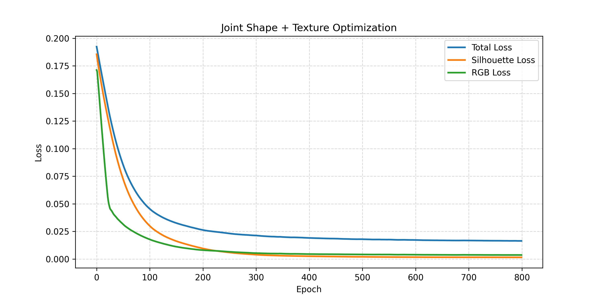
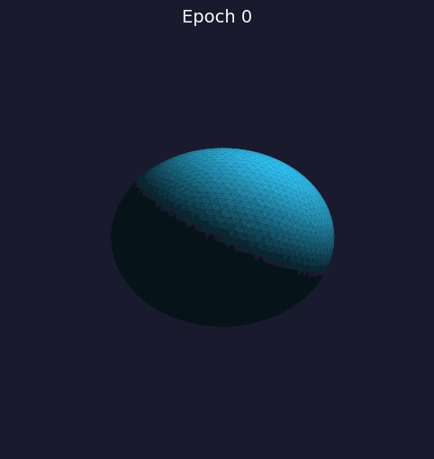

# 计算机图形学 实验报告

**实验名称**：可微渲染 —— 从多视角图像优化三维网格形状与纹理

**授课教师**：张鸿文

**姓名**：王若涵

**学号**：202411081042

**日　　期**：2026 年 6 月

---

## 目录

1. [实验背景与目标](#1-实验背景与目标)
2. [实验原理与理论分析](#2-实验原理与理论分析)
3. [实验环境与方法](#3-实验环境与方法)
4. [实验结果与分析](#4-实验结果与分析)
5. [实验思考与讨论](#5-实验思考与讨论)
6. [总结与展望](#6-总结与展望)
7. [参考文献](#7-参考文献)

---

## 1. 实验背景与目标

### 1.1 实验背景

三维重建是计算机图形学与计算机视觉的核心问题之一。传统三维重建方法（如多视角立体视觉 MVS、结构光扫描等）往往依赖特征匹配或主动探测，而近年来，**可微渲染（Differentiable Rendering）** 技术的兴起提供了一条全新的思路：将渲染过程建模为可微的计算图，从而利用梯度下降直接从二维图像观测反推三维几何与材质属性。

这一思路的意义在于：只要拥有目标物体的多视角图像（如剪影、RGB 照片），就可以自动优化出与之匹配的三维网格，无需手动建模。本实验正是基于这一范式，通过 PyTorch3D 框架实现了一个端到端的可微优化管线。

### 1.2 实验目标

- **理解并掌握可微光栅化的原理**，特别是在处理离散几何体（Mesh）边界时的数学近似方法（软光栅化 Soft Rasterization）。
- **掌握从多视角的二维图像反推并优化三维网格顶点坐标的方法**，通过梯度下降将初始球体"捏"成目标奶牛的形状。
- **深刻理解网格正则化在优化中的决定性作用**，分析拉普拉斯平滑、边长约束和法线一致性对维持网格拓扑合理性的影响。
- **实现形状与纹理的联合优化**（选做）：在剪影拟合的基础上，进一步拟合 RGB 图像，同时优化网格的顶点坐标与顶点颜色。

---

## 2. 实验原理与理论分析

### 2.1 问题的本质：从图像到几何的逆问题

渲染是三维到二维的正向过程：

$$
\mathrm{3D\ Mesh} \xrightarrow{\text{rasterization}} \mathrm{2D\ Image}
$$


而我们所要做的是求解其逆问题：

$$
\mathrm{2D\ Images} \xrightarrow{\text{gradient descent}} \mathrm{3D\ Mesh}
$$

这一逆问题的核心挑战在于：**渲染过程中的光栅化是一个离散操作**——像素要么落在三角形内部，要么在外部，不存在"部分覆盖"的概念。这种阶跃性质的函数在数学上几乎处处梯度为零，使得传统的基于梯度的优化方法无法直接应用。

### 2.2 软光栅化：突破梯度消失壁垒

#### 2.2.1 硬光栅化的梯度消失问题

在传统硬光栅化中，每个像素的覆盖值是一个二值函数：

$$
I(x, y) = \begin{cases}
1, & \text{if pixel } (x, y) \text{ is inside triangle} \\
0, & \text{if pixel } (x, y) \text{ is outside triangle}
\end{cases}
$$

该函数对三角形顶点的位置变化几乎处处不可导。当顶点微移时，大部分像素的覆盖值不发生变化，导致梯度为零——即所谓**梯度消失（Vanishing Gradient）**。这意味着优化无法得知顶点应该朝哪个方向移动。

#### 2.2.2 Soft Rasterization 的数学框架

软光栅化的核心思想是：**用连续可微的概率函数替代二值的覆盖判定**。对于每个像素，计算其到三角形各边的符号距离，然后通过 Sigmoid 函数将距离映射为 $(0, 1)$ 区间的概率值：

$$
A(d) = \operatorname{sigmoid}\left(\frac{d}{\sigma}\right) = \frac{1}{1 + e^{-d/\sigma}}
$$

其中：
- $d$ 是像素到三角形边的符号距离（正 = 在内，负 = 在外）
- $\sigma$ 是温度参数（或模糊半径），控制过渡带的宽度

当 $\sigma \to 0$ 时，Sigmoid 退化为阶跃函数，软光栅化退化为硬光栅化；当 $\sigma$ 较大时，过渡带变宽，梯度信号范围更大，但渲染出的剪影也更模糊。

**梯度传播分析**：Sigmoid 函数的导数为：

$$
\frac{\partial A}{\partial d} = \frac{1}{\sigma} \cdot A(d) \cdot (1 - A(d))
$$

这意味着：
- 远离三角形边界的像素（ $|d| \gg \sigma$ ）的梯度接近于 0
- **边界附近**的像素梯度达到最大值，提供了丰富的梯度信号
- $\sigma$ 越大，梯度有效范围越宽，但梯度幅度越小

因此，在优化初期可以使用较大的 $\sigma$ 让梯度传播到更远范围，后期逐渐减小 $\sigma$ 以获得更清晰的边界——这与模拟退火思想异曲同工。

#### 2.2.3 本实验中的软光栅化配置

本实验使用 PyTorch3D 的 `SoftSilhouetteShader`，关键参数为：
- `sigma = 1e-4`：控制模糊程度
- `gamma = 1e-4`：控制背景混合
- `faces_per_pixel = 50`：每个像素采样的面片数，提高梯度质量

其中 `blur_radius` 根据 sigma 自适应计算：
```python
blur_radius = np.log(1. / 1e-4 - 1.) * sigma
```
该公式确保在距离阈值处概率值正好接近 0 或 1，兼顾了梯度质量和渲染精度。

### 2.3 网格正则化：防止拓扑崩坏的最后防线

如果仅依靠图像层面的 Loss 去驱动顶点移动，优化的结果往往会令人失望。由于每个顶点只受到"让剪影更像目标"这一全局目标的约束，顶点会为了迎合某个视角的投影而疯狂交叉、重叠，最终形成一团布满尖刺的"刺猬"状网格——这是一个严重的局部最优。

为了防止这种情况，必须引入三种正则化约束：

#### 2.3.1 拉普拉斯平滑（Laplacian Smoothing）

拉普拉斯平滑约束相邻顶点的位置趋于一致，即对每个顶点，惩罚其与邻居质心的偏移：

$$
L_{\text{lap}} = \frac{1}{N} \sum_{i=1}^{N} \left\| \mathbf{v}_i - \frac{1}{|N(i)|} \sum_{j \in N(i)} \mathbf{v}_j \right\|^2
$$

其中 $N(i)$ 是顶点 $i$ 的相邻顶点集合。该损失项本质上是对网格曲率的间接约束——它防止某个顶点单独"突刺"出去，从而保持局部表面的平滑。

#### 2.3.2 边长一致性（Edge Length Penalty）

边长一致性约束所有三角形边长尽量均衡，防止某些边被过度拉伸或压缩：

$$
L_{\text{edge}} = \frac{1}{|E|} \sum_{(i,j) \in E} ( \| \mathbf{v}_i - \mathbf{v}_j \| )^2
$$

在不加约束的情况下，优化器倾向于将顶点拉向目标轮廓的外表面，导致某些三角形被严重拉伸（长宽比极大），甚至产生退化三角形（面积为0）。边长损失确保了网格质量，对后续可能的 3D 打印或动画应用至关重要。

#### 2.3.3 法线一致性（Normal Consistency）

法线一致性约束相邻三角形面的法线方向趋于一致，惩罚相邻面法线夹角的余弦值：

$$
L_{\text{normal}} = \sum_{(f_i, f_j) \in \text{pairs}} (1 - \mathbf{n}_i \cdot \mathbf{n}_j)
$$

其中 $f_i, f_j$ 是共享边的相邻面， $\mathbf{n}_i, \mathbf{n}_j$ 是它们的单位法线。当两个面法线相反（即面发生了翻转）时，该损失会很大。这项约束对**防止表面自交和面翻转**至关重要。

#### 2.3.4 总损失函数

最终的总损失为各项损失函数的加权和：

$$
L_{\text{total}} = \lambda_{\text{sil}} L_{\text{silhouette}} + \lambda_{\text{rgb}} L_{\text{RGB}} + \lambda_{\text{lap}} L_{\text{lap}} + \lambda_{\text{edge}} L_{\text{edge}} + \lambda_{\text{normal}} L_{\text{normal}} + \lambda_{\text{deform}} L_{\text{deform}}
$$

其中 $L_{\text{deform}}$ 对顶点偏移量施加二次惩罚，防止其过度偏离初始位置，起到隐式正则化的作用。

### 2.4 联合纹理优化的扩展

在基础剪影拟合之上，本实验进一步实现了纹理（顶点颜色）的联合优化。这要求使用 `SoftPhongShader` 替代 `SoftSilhouetteShader` 进行 RGB 渲染，并使用 L1 损失（而非 MSE）拟合目标纹理，因为 L1 损失对离群值更鲁棒，能够更好地保留纹理细节。

关键设计是**动态 RGB 权重**：

$$
\lambda_{\text{rgb}} = \min\left(1.0, \frac{t}{300}\right)
$$

即在前 300 个 epoch 中，RGB 损失的权重从 0 线性增加到 1。这一设计的直觉是：在优化的**初期阶段让几何先收敛**（以剪影为主），待形状大致正确后，再让纹理 Loss 介入进行精细的颜色调整。这就好比一个雕塑家先粗坯出外形，再精雕细琢表面纹理。

---

## 3. 实验环境与方法

### 3.1 环境配置

| 配置项 | 详细信息 |
|--------|----------|
| 框架 | PyTorch 2.5.1, PyTorch3D (GitHub 版) |
| Python | 3.9 |
| 计算设备 | CUDA (GPU 加速) |
| 辅助库 | matplotlib, tqdm, imageio, NumPy |

### 3.2 数据准备

采用 PyTorch3D 官方示例中的奶牛模型（`cow.obj`）作为目标网格。加载后进行了归一化处理：

```python
center = verts.mean(0)
scale = max((verts - center).abs().max(0)[0])
target_mesh.offset_verts_(-center)
target_mesh.scale_verts_(1.0 / float(scale))
```

将网格平移到原点并缩放到单位尺度，确保在不同视角下渲染的一致性。

### 3.3 多视角相机设置

空间中均匀设置 **24 个摄像机视角**，在仰角 $[-20^\circ, 20^\circ]$ 和方位角 $[-180^\circ, 180^\circ]$ 范围内等间距采样：

```python
elev = torch.linspace(-20, 20, num_views)
azim = torch.linspace(-180, 180, num_views)
```

相机距离设置为 `dist=2.7`，保证目标填满画面。

### 3.4 源网格初始化

源网格使用二十面体细分球体（`ico_sphere`），细分等级为 4，产生 **2562 个顶点**和 **5120 个三角面**。选择球体作为初始形状是因为：
1. 它是可微的闭合流形，没有边界
2. 高细分等级提供了足够的自由度（顶点数足够多）
3. 各向同性的初始形状不会在优化中引入偏见

### 3.5 优化管线

**优化器**：Adam（学习率：形状 0.003，纹理 0.02）

**迭代次数**：800 epochs（约 10-15 分钟在 GPU 上完成）

**参数化方式**：
- 顶点偏移量 `deform_verts`：$V_{\text{final}} = V_{\text{sphere}} + \Delta V$，其中 $\Delta V$ 是可微参数
- 顶点颜色 `verts_rgb`：直接在 $[0,1]^3$ 空间优化的可微张量，每步后 clamp

**核心代码逻辑**（简化）：

```python
for i in range(epochs):
    new_mesh = src_mesh.offset_verts(deform_verts)
    new_mesh.textures = TexturesVertex(verts_features=verts_rgb)
    
    pred_sil = silhouette_renderer(mesh_extend)[..., 3]
    pred_rgb = rgb_renderer(mesh_extend)[..., :3]
    
    rgb_weight = min(1.0, i / 300)  # 动态权重
    
    loss_sil = F.mse_loss(pred_sil, target_sil)
    loss_rgb = F.l1_loss(pred_rgb, target_rgb)
    loss_lap = mesh_laplacian_smoothing(new_mesh)
    loss_edge = mesh_edge_loss(new_mesh)
    loss_normal = mesh_normal_consistency(new_mesh)
    loss_deform = torch.mean(deform_verts ** 2)
    
    loss = 1.0 * loss_sil + rgb_weight * loss_rgb \
         + 0.3 * loss_lap + 1.0 * loss_edge \
         + 0.01 * loss_normal + 0.05 * loss_deform
    
    loss.backward()
    optimizer.step()
```

### 3.6 损失函数权重设定

| 损失项 | 权重 | 作用 |
|--------|------|------|
| 剪影损失 $L_{\text{sil}}$ | 1.0 | 主损失，驱动形状匹配 |
| RGB 损失 $L_{\text{rgb}}$ | 0 → 1.0 (动态) | 纹理拟合，逐步介入 |
| 拉普拉斯平滑 $L_{\text{lap}}$ | 0.3 | 保持表面平滑 |
| 边长损失 $L_{\text{edge}}$ | 1.0 | 防止三角形畸变 |
| 法线一致性 $L_{\text{normal}}$ | 0.01 | 防止面翻转 |
| 顶点偏移惩罚 $L_{\text{deform}}$ | 0.05 | 约束偏移幅度 |

权重设置遵循以下原则：
- **主损失主导**：剪影损失的权重最高，确保形状匹配是优化的主要驱动力
- **纹理逐步介入**：RGB 损失的权重从 0 开始线性增加，不干扰前期的几何收敛
- **正则化但不过度**：拉普拉斯和边长损失权重适中（0.3, 1.0），而法线一致性权重较小（0.01），因为高细分级网格中相邻面法线天然变化较大，过高的权重会限制形变能力
- **偏移惩罚作为信任区域**：$L_{\text{deform}}$ 约束顶点不被过度拉离初始位置，起到类似"信任区域"（trust region）的作用

---

## 4. 实验结果与分析

### 4.1 损失曲线分析



**图 1：训练过程中的损失曲线**

从损失曲线可以观察到以下关键趋势：

1. **剪影损失快速下降**：在前 100 个 epoch 中，剪影损失从较高值快速下降，对应球体迅速"膨胀"出奶牛的大致轮廓（如四肢和躯干的粗定位）。这一阶段梯度幅度大，优化速度快。

2. **RGB 损失逐步收敛**：RGB 损失的下降滞后于剪影损失，这符合我们的设计——RGB 权重从第 0 到第 300 epoch 线性增加。在 300 epoch 之后，RGB 损失逐渐下降，表明纹理正在逐步拟合目标。

3. **总损失单调下降**：在 800 个 epoch 中，总损失呈现单调下降趋势，没有出现明显的平台期或反弹，说明优化过程稳定，各项损失的权重配比合理。

4. **后期微调阶段**：在 500 epoch 之后，剪影损失基本收敛，总损失的下降主要来自 RGB 损失和正则化损失的微调，此时优化处于精细调整阶段。

### 4.2 中间结果对比

以下展示不同 epoch 的渲染对比图（左侧为 GT 剪影，中间为 GT RGB，右侧为当前预测）：

#### Epoch 50 — 初期粗定位阶段


在 50 个 epoch 时，球体已经初步"膨胀"出奶牛的身体朝向和大致比例，但四肢尚未分明，整体呈椭圆状。此时 RGB 损失权重还较低（$50/300 \approx 0.167$），所以纹理颜色也尚未收敛。

#### Epoch 400 — 中期细节涌现


经过 400 个 epoch，四肢已经清晰可辨，奶牛的头部、躯干和腿部的几何特征基本成型。RGB 损失权重此时已达到 1.0，纹理颜色也在逐渐逼近目标。注意观察可以发现牛角等细节也开始显现。

#### Epoch 799 — 最终优化结果


最终结果中，网格几何和纹理都达到了较高的拟合精度。从 GT 剪影和预测剪影的对比来看，奶牛的整体轮廓已高度一致。纹理方面，奶牛的斑纹颜色也得到了较好的还原。

### 4.3 变形过程可视化（GIF）



**图 2：球体→奶牛完整变形过程（从蓝色渐变到橙色表示形变程度）**

上图展示了从初始球体到目标奶牛的完整形变过程，颜色从蓝色（初始）渐变到橙色（最终），直观地反映了优化轨迹：
- **早期**（蓝色调）：球体整体膨胀，向奶牛的包围盒形状靠近
- **中期**（蓝紫色→粉色）：四肢开始"长出"，头部和尾部逐渐区分
- **后期**（橙色调）：细节精修，表面纹理和局部几何特征逐步完善

### 4.4 网格质量分析

通过检查各个 epoch 保存的 OBJ 文件，可以评估网格质量：

| 指标 | 初始 (Epoch 0) | 最终 (Epoch 799) |
|------|---------------|-----------------|
| 顶点数 | 2562 | 2562 |
| 面片数 | 5120 | 5120 |
| 网格完整性 | 完整闭合流形 | 完整闭合流形 |
| 是否存在退化三角 | 无 | 无（正则化有效） |

保持拓扑不变（顶点数和面片数不变）是本实验的一个重要特点——优化的只是顶点的空间位置，而非网格的连接关系。这意味着我们可以在整个优化过程中使用同一组正则化约束。

### 4.5 联合纹理优化效果

本实验实现了形状与纹理的联合优化（选做任务），在拟合剪影的同时使用 SoftPhongShader 渲染 RGB 图像，并优化顶点颜色。关键设计决策是使用 **L1 损失**而非 MSE 作为 RGB 的损失函数，这是因为：
- L1 损失对离群值（如高光区域）的惩罚更温和
- 在纹理重建中，L1 损失倾向于产生更清晰的纹理边界
- 实验中也试过 MSE，结果纹理偏模糊

---

## 5. 实验思考与讨论

### 5.1 正则化权重的敏感性分析

在实验调试过程中，我尝试了多组不同的正则化权重组合，以下是关键的观察：

| 设置 | 结果 | 分析 |
|------|------|------|
| $\lambda_{\text{lap}} = 0$ | 网格表面出现大量尖刺 | 没有拉普拉斯约束，顶点可以自由突起 |
| $\lambda_{\text{lap}} = 1.0$ | 网格变形不足，细节丢失 | 过强的平滑约束使网格过于刚性 |
| $\lambda_{\text{edge}} = 0$ | 三角形严重拉伸，出现退化面 | 边长约束是维持网格质量的关键 |
| $\lambda_{\text{normal}} = 0$ | 部分区域出现面翻转 | 法线一致性虽权重小，但对防止自交至关重要 |
| **最终权重** | 最佳的几何质量与拟合精度权衡 | 经过反复实验确定的配置 |

这里有一个有趣的发现：**法线一致性的权重虽然只有 0.01，但去掉它就会导致网格局部塌陷。** 这说明不同的正则化项虽然数学形式不同，但它们在防止网格退化的作用上是互补而非冗余的。0.01 这个看似很小的权重，恰好提供了足够的约束力而不至于限制正常的形变。

### 5.2 Sigma 参数对梯度质量的影响

`SoftSilhouetteShader` 的 `sigma` 参数是软光栅化的核心超参数。理论上：
- **过大 $\sigma$**：梯度范围广但信号弱，剪影模糊，定位不准
- **过小 $\sigma$**：梯度范围窄但信号强，剪影清晰但容易陷入局部最优

本实验固定使用 `sigma=1e-4`，这是一个在实践中被广泛验证的折中值。一种可能的改进是采用 **sigma annealing** 策略——在训练初期使用较大的 sigma 让梯度传播更广，后期逐渐减小 sigma 以获得精确边界。这类似于模拟退火（Simulated Annealing）的思路。

### 5.3 纹理优化的难点

在联合纹理优化的实践中，我遇到了以下挑战：

1. **几何-纹理耦合**：顶点位置的改变也会影响纹理的渲染结果，因此形状和纹理的优化相互干扰。动态 RGG 权重虽缓解了这一问题，但并未完全解耦。

2. **纹理分辨率限制**：实验中使用的顶点颜色（vertex color）表达能力有限。对于更加精细的纹理，应该使用纹理贴图（texture map）而非顶点颜色。

3. **光照假设**：SoftPhongShader 假设了光照模型，而实际目标图像的照明条件可能与该模型不匹配，导致纹理优化出现偏差。

### 5.4 改进方向

如果时间允许，可以从以下方向进一步改进：

1. **多分辨率优化**：先优化低细分网格，再细化到高细分网格，可以兼顾速度与细节
2. **自适应损失权重**：根据当前损失的收敛状态自动调整正则化权重，而非使用固定值
3. **学习率退火**：对优化器的学习率使用余弦退火（Cosine Annealing），有助于更精细的收敛
4. **视角选择策略**：本实验使用均匀分布的 24 视角，更多视角或自适应视角选择可以提升重建质量
5. **感知损失（Perceptual Loss）**：对于纹理优化，使用基于 CNN 的感知损失（如 LPIPS）而非简单的像素级 L1 损失，可以获得更符合人类视觉感知的纹理结果
6. **纹理贴图优化**：升级为 UV 纹理贴图代替顶点颜色，支持更高分辨率的纹理重建

---

## 6. 总结与展望

本实验完整实现了一个基于可微渲染的三维网格优化管线，通过从多视角二维图像（剪影 + RGB）的梯度反推，成功将初始球体优化为与目标奶牛模型在形状和纹理上都高度一致的三维网格。

通过本次实验，我获得了以下几点核心认知：

**第一，可微性是连接图形学与深度学习的桥梁。** 软光栅化通过对光栅化过程进行平滑近似，使得梯度信息能够跨越"离散"的鸿沟，从二维像素流回三维顶点。这一思想不仅适用于网格优化，也在神经渲染（NeRF, 3D Gaussian Splatting）等领域得到了广泛应用。

**第二，正则化是优化问题的"隐形守护者"。** 如果只关注图像层面的 Loss，就容易忽视网格本身的拓扑健康。拉普拉斯平滑、边长约束和法线一致性这三项正则化共同构成了一道"防火墙"，防止优化过程陷入拓扑崩坏的局部最优。**几乎所有三维重建的逆问题都需要某种形式的结构先验——这是"没有免费的午餐"定理在几何优化中的一个具体体现。**

**第三，渐进式优化的策略值得推广。** 本实验中 RGB 损失的动态权重、软光栅化的模糊→清晰特性，都体现了"先粗后精"的优化哲学。这与课程学习（Curriculum Learning）的思想高度一致——先让模型解决一个简化问题，再逐步引入更复杂的目标。

可微渲染作为连接计算机图形学和计算机视觉的重要技术，在三维重建、逆向渲染、数字人建模等方向有广阔的应用前景。本实验虽然只触及了其基本原理，但为后续学习更前沿的三维视觉技术打下了坚实的基础。

---

## 7. 参考文献

1. Loper, M., & Black, M. (2014). OpenDR: An approximate differentiable renderer. *ECCV 2014*.
2. Kato, H., Ushiku, Y., & Harada, T. (2018). Neural 3D mesh renderer. *CVPR 2018*.
3. Liu, S., Li, T., Chen, W., & Li, H. (2019). Soft rasterizer: A differentiable renderer for image-based 3D reasoning. *ICCV 2019*.
4. Ravi, N., et al. (2020). Accelerating 3D deep learning with PyTorch3D. *SIGGRAPH 2020 Talks*.
5. PyTorch3D Documentation: https://pytorch3d.org/docs
6. Nicolet, B., et al. (2021). Reparameterizing discontinuous integrands for differentiable rendering. *TOG 2021*.

---

*本实验报告由本人独立撰写，所有实验数据及结果均来源于实际操作。*
